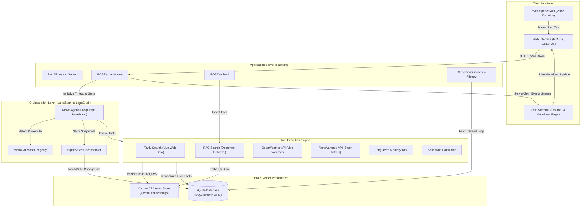
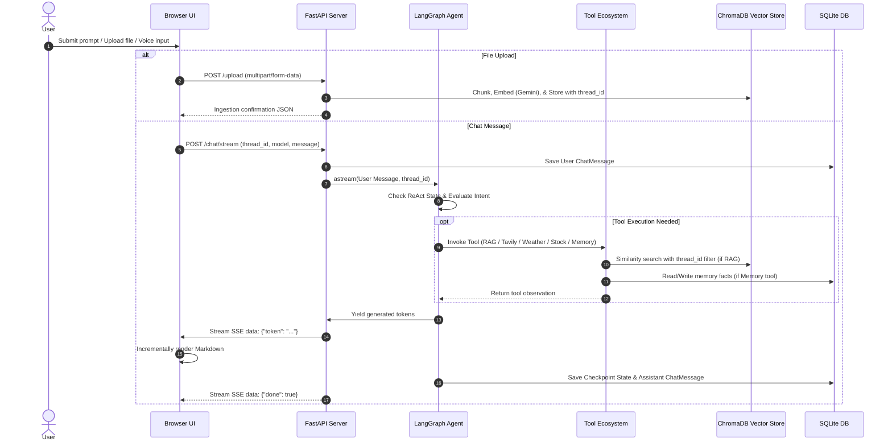
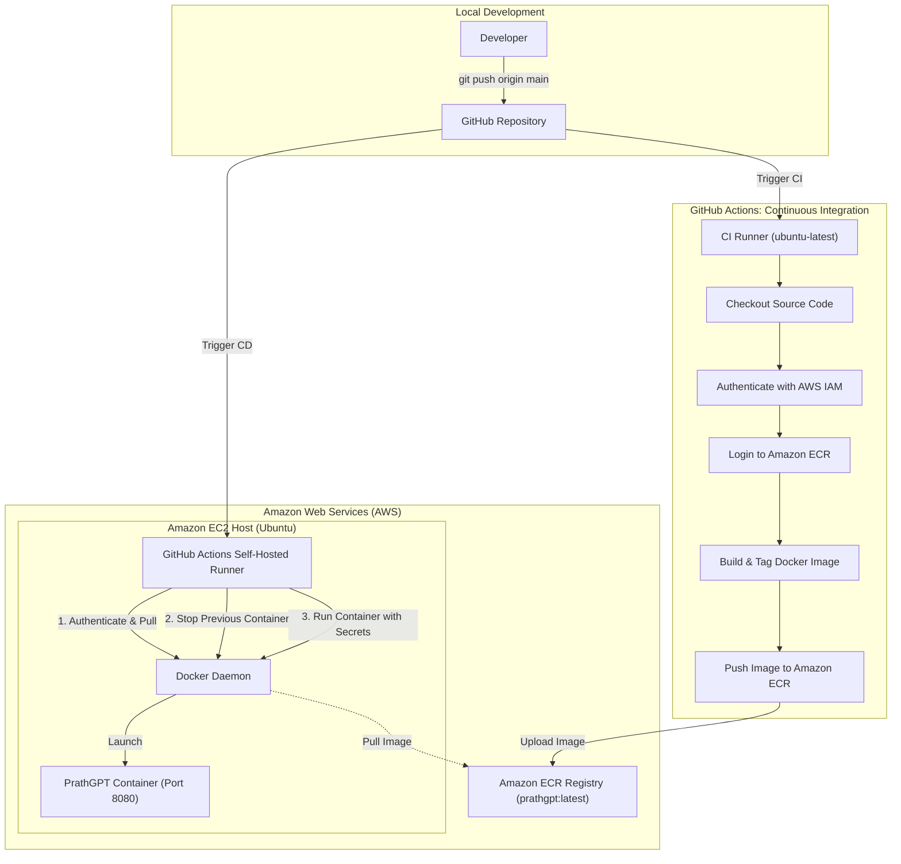

# PrathGPT: Agentic AI Assistant

PrathGPT is an autonomous, full-stack agentic AI system engineered with Python, FastAPI, LangGraph, LangChain, Mistral AI, Google Gemini Embeddings, ChromaDB, and SQLite. The platform provides real-time token streaming, isolated Retrieval-Augmented Generation (RAG), multi-tool decision making, persistent conversational memory, voice input capabilities, and an automated continuous integration and continuous deployment (CI/CD) pipeline on Amazon Web Services (AWS).

* Live Deployment URL: http://ec2-13-235-67-247.ap-south-1.compute.amazonaws.com:8080/
* Source Repository: https://github.com/PrathmeshRanjan/PrathGPT

---

## Architecture Overview

PrathGPT utilizes a decoupled, asynchronous architecture separating agent orchestration, vector storage, relational persistence, and the streaming presentation layer.



---

## Key Technical Features

### 1. ReAct Agent Orchestration with LangGraph
* Cyclic Graph Execution: Employs a ReAct (Reasoning + Acting) loop where the model analyzes queries, determines required tools, evaluates observations, and iterates until the objective is resolved.
* Resilient Checkpointing: Implements SqliteSaver from langgraph-checkpoint-sqlite to persist conversation graph state per thread_id, preserving multi-turn conversational context across restarts.
* Dynamic Model Selection: Runtime model switching across Mistral AI models including mistral-small-latest, mistral-medium-latest, mistral-large-latest, ministral-8b-latest, ministral-3b-latest, ministral-14b-latest, and codestral-latest.

### 2. Thread-Isolated Retrieval-Augmented Generation (RAG)
* Multi-Format Ingestion: Parses .pdf, .docx, .txt, .md, .py, and .csv documents.
* Semantic Chunking: Splits documents into 900-character segments with 150-character overlaps using RecursiveCharacterTextSplitter.
* Dense Vector Embeddings: Generates embeddings using Google Gemini (gemini-embedding-001).
* ChromaDB Storage with Thread Metadata Isolation: Chunks are stored in ChromaDB and tagged with metadata containing the active thread_id, ensuring strict tenant isolation where conversations cannot access documents uploaded in different sessions.

### 3. Dual-Layer Persistence Architecture
* Session State Checkpoints: LangGraph checkpoint schema stores node states, serialized message histories, and step counts.
* Relational History and Knowledge Storage: SQLAlchemy manages relational tables (Conversation, ChatMessage, and LongTermMemory).
* Long-Term Memory System: Allows the agent to explicitly store and semantically retrieve permanent user preferences, facts, and profile information across disparate conversation threads.

### 4. High-Performance Token Streaming
* Asynchronous Server-Sent Events (SSE): Delivers token-by-token response streams over HTTP using FastAPI StreamingResponse.
* Token and Event Filtering: Automatically intercepts and consumes internal LangGraph tool payloads and system state updates while streaming only human-facing tokens to the client.
* Client-Side Real-Time Rendering: The frontend consumes binary SSE chunks using ReadableStream and TextDecoder, formatting Markdown elements (bold, italics, code blocks, lists, tables) dynamically via marked.js.

### 5. Multi-Tool Ecosystem
* Tavily Web Search: Real-time web retrieval for current events, breaking news, and up-to-date data.
* Financial Market Data: AlphaVantage integration for real-time stock quotes, open/high/low/volume data, and ticker analysis.
* Weather Forecasting: OpenWeatherMap integration returning temperature, humidity, wind speeds, and atmospheric conditions.
* Safe Scientific Calculator: Sandboxed mathematical evaluation engine utilizing Python math module primitives.
* Long-Term Memory Manager: Dedicated retrieval and persistence tools for unstructured memory indexing.

---

## Technology Stack

| Domain | Technology | Description |
| :--- | :--- | :--- |
| Backend Framework | FastAPI | High-performance asynchronous Python web framework |
| Server Gateway | Uvicorn | Lightning-fast ASGI web server implementation |
| Agent Framework | LangGraph & LangChain | Graph-based state machine and tool orchestration |
| LLM Provider | Mistral AI | Primary model inference provider |
| Embedding Provider | Google Gemini | Dense vector embedding model (gemini-embedding-001) |
| Vector Database | ChromaDB | Local vector store for semantic similarity search |
| Relational ORM | SQLAlchemy & SQLite | Relational schema management and memory persistence |
| Checkpoint Storage | LangGraph SQLite Saver | Thread state snapshot persistence engine |
| Web Search API | Tavily Search | Search engine optimized for LLM tool consumption |
| Frontend Stack | Vanilla HTML5 / CSS3 / JS | Dark-themed ChatGPT-style responsive user interface |
| Markdown Parser | Marked.js | Client-side real-time streaming markdown parsing |
| Speech Engine | Web Speech API | Browser-native voice recognition and dictation |
| Containerization | Docker | Linux container packaging and runtime environment |
| Cloud Provider | Amazon Web Services (AWS) | ECR image registry and EC2 compute infrastructure |
| CI/CD Engine | GitHub Actions | Automated build, push, pull, and deployment pipeline |

---

## End-to-End Sequence Diagram



---

## AWS CI/CD and DevOps Architecture

The project implements a zero-downtime, fully automated CI/CD pipeline using GitHub Actions, Amazon Elastic Container Registry (ECR), and an Amazon EC2 instance configured with a self-hosted runner.



### Continuous Integration Pipeline
1. Triggered automatically on push to the main branch.
2. Checks out the latest codebase.
3. Authenticates with AWS using IAM credentials stored securely in GitHub Secrets.
4. Logs into Amazon ECR.
5. Builds the production Docker image and tags it as latest.
6. Pushes the Docker image to Amazon ECR repository prathgpt.

### Continuous Deployment Pipeline
1. Triggered upon successful completion of the CI job.
2. Executes directly on the EC2 host via the GitHub self-hosted runner.
3. Logs into Amazon ECR from the EC2 instance.
4. Pulls the latest container image.
5. Gracefully stops and removes previous container instances.
6. Launches the new container with production restart policies (--restart always), host-to-container port mapping (8080:8080), and environment variable injection.
7. Executes docker image prune -f to maintain host disk hygiene.

---

## Project Structure

```text
PrathGPT/
|-- app.py                  # FastAPI server, endpoints, and SSE stream handler
|-- agent.py                # LangGraph ReAct agent, state definition, model registry
|-- database.py             # SQLAlchemy models, SQLite configuration, CRUD helpers
|-- rag.py                  # Multi-format parsing, Gemini embeddings, ChromaDB RAG
|-- tools.py                # Tool definitions (Tavily, weather, stock, calculator, memory)
|-- requirements.txt        # Production Python dependencies
|-- .env.example            # Environment configuration template
|-- Dockerfile              # Docker container specification
|-- .dockerignore           # Exclusions for lean container packaging
|-- .gitignore              # Git ignored files and secret protections
|-- DEPLOYMENT.md           # Deployment runbook and AWS setup guide
|-- README.md               # System documentation and architecture specifications
|
|-- .github/
|   `-- workflows/
|       `-- cicd.yaml       # GitHub Actions CI/CD pipeline definition
|
|-- template/
|   `-- index.html          # Web UI with voice input and streaming Markdown
|
|-- uploads/                # Local document upload directory (git-ignored)
|-- data/                   # SQLite database and checkpoints (git-ignored)
`-- chroma_db/              # ChromaDB vector store directory (git-ignored)
```

---

## Local Setup and Installation

### Prerequisites
* Python 3.11
* Git
* Virtualenv or Conda
* API Keys: Mistral AI, Google Gemini, Tavily (OpenWeather and AlphaVantage optional)

### 1. Clone the Repository
```bash
git clone https://github.com/PrathmeshRanjan/PrathGPT.git
cd PrathGPT
```

### 2. Create and Activate Virtual Environment
```bash
python3.11 -m venv venv
source venv/bin/activate
```

### 3. Install Dependencies
```bash
pip install --upgrade pip
pip install -r requirements.txt
```

### 4. Configure Environment Variables
Copy `.env.example` to `.env` and fill in your API keys:
```bash
cp .env.example .env
```
```env
MISTRAL_API_KEY=your_mistral_api_key
GOOGLE_API_KEY=your_google_api_key
TAVILY_API_KEY=your_tavily_api_key
OPENWEATHER_API_KEY=your_openweather_api_key
ALPHAVANTAGE_API_KEY=your_alphavantage_api_key

LANGSMITH_TRACING=false
LANGSMITH_ENDPOINT=https://api.smith.langchain.com
LANGSMITH_API_KEY=your_langsmith_api_key
LANGSMITH_PROJECT=prathgpt
```

### 5. Start the Application
```bash
python app.py
```
The server will start at: http://127.0.0.1:8080

---

## Docker Local Run

### Build the Image
```bash
docker build -t prathgpt .
```

### Run the Container
```bash
docker run -d   --name prathgpt   --restart always   -p 8080:8080   --env-file .env   prathgpt
```
Access the application at http://localhost:8080

---

## API Reference

### Chat Streaming Endpoint
* Route: POST /chat/stream
* Content-Type: application/json
* Request Body:
  ```json
  {
    "message": "What are the latest developments in AI agents?",
    "thread_id": "3b29c910-5309-4e56-821b-1a98263152d0",
    "model": "mistralai:mistral-small-latest"
  }
  ```
* Response: text/event-stream returning Server-Sent Events with incremental tokens.

### Document Upload Endpoint
* Route: POST /upload
* Content-Type: multipart/form-data
* Form Data:
  * file: Binary document file (.pdf, .docx, .txt, .md, .py, .csv)
  * thread_id: UUID string representing the target conversation thread
* Response: JSON with status, filename, and total ingested chunk count.

### Conversation Endpoints
* GET /conversations: Returns a list of all saved conversation threads.
* GET /history/{thread_id}: Returns complete chronological message history for a specific thread.
* GET /models: Returns the list of supported Mistral AI models.

---

## License

This project is licensed under the MIT License.
